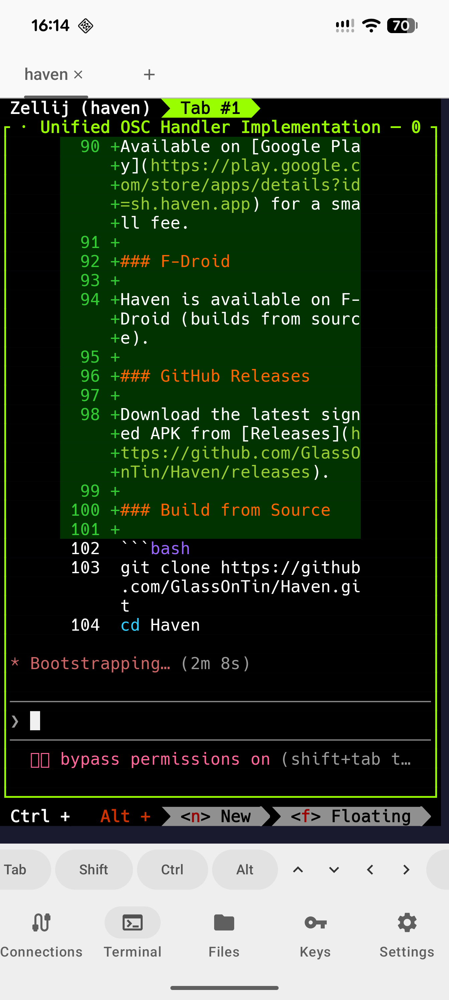

# Haven

Open-source SSH and SFTP client for Android.

Connect to your servers with a full terminal emulator, browse and transfer files over SFTP, and manage your SSH keys — all from your phone.

Haven is free to build yourself or install from [F-Droid](https://f-droid.org) and [GitHub Releases](https://github.com/GlassOnTin/Haven/releases). Also available on [Google Play](https://play.google.com/store/apps/details?id=sh.haven.app) for a nominal fee.

## Screenshots

<p float="left">
  
  
  
</p>

## Features

### Terminal

- Full VT100/xterm terminal emulator with Unicode support (bundled Hack font)
- **Multi-tab sessions** — open several shells on the same host
- **Session manager integration** — auto-attach to tmux, zellij, screen, or byobu sessions
- **Mouse mode** — vertical swipes send SGR scroll events to TUI apps (vim, zellij, htop)
- **Keyboard toolbar** — Esc, Tab, Ctrl, Alt, arrow keys, and common shell symbols (| ~ / -)
- **Text selection** — long-press to select with word expansion, d-pad anchor adjustment, copy, and Open URL button
- Configurable font size (8–32 sp)
- 6 color schemes: Haven, Classic Green, Light, Solarized Dark, Dracula, Monokai

### OSC Sequences

Remote programs can interact with Android through standard terminal escape sequences:

| OSC | Function | Example |
|-----|----------|---------|
| 52 | Set clipboard | `printf '\e]52;c;%s\a' "$(echo -n text \| base64)"` |
| 8 | Hyperlinks | `printf '\e]8;;https://example.com\aClick\e]8;;\a'` |
| 9 | Notification | `printf '\e]9;Build complete\a'` |
| 777 | Notification (with title) | `printf '\e]777;notify;CI;Pipeline green\a'` |
| 7 | Working directory | `printf '\e]7;file:///home/user\a'` |

Notifications appear as a toast when Haven is in the foreground, or as an Android notification when in the background. Unrecognised OSC numbers (0, 4, 10, etc.) pass through to the emulator.

### Reticulum

- Connect over [rnsh](https://github.com/acehoss/rnsh) via Sideband or direct TCP gateway
- **Announce-based discovery** — auto-discovers rnsh destinations on the Reticulum network with hop count
- Periodic refresh of discovered destinations
- Multi-tab support (same as SSH)

### SFTP File Browser

- Browse remote directories with navigation and back button
- Upload files from device, download to device, delete, copy path
- Toggle hidden files, sort by name/size/date
- Multi-server tabs

### SSH Key Management

- Generate Ed25519, RSA, and ECDSA keys on-device
- One-tap copy public key in OpenSSH format
- Deploy key dialog for easy `authorized_keys` setup
- Keys stored encrypted in local storage

### Connections

- Save profiles with label, host, port, username, auth method, and color tag
- Trust-on-first-use (TOFU) host key verification with SHA256 fingerprint display
- Host key change detection with old-vs-new fingerprint comparison
- Auto-reconnect with exponential backoff
- Password authentication fallback

### Security and Privacy

- **Biometric app lock** — fingerprint or face authentication via Android BiometricPrompt
- **No data collection** — no telemetry, analytics, ads, or tracking
- **Local storage only** — all data stays on your device
- **No third-party services** — no analytics SDKs or crash reporting
- See [PRIVACY_POLICY.md](PRIVACY_POLICY.md) for details

### Theming

- Light, dark, and system-default themes
- Material You dynamic colors on Android 12+

## Install

### Google Play

Available on [Google Play](https://play.google.com/store/apps/details?id=sh.haven.app) for a small fee.

### F-Droid

Haven is available on F-Droid (builds from source).

### GitHub Releases

Download the latest signed APK from [Releases](https://github.com/GlassOnTin/Haven/releases).

### Build from Source

```bash
git clone https://github.com/GlassOnTin/Haven.git
cd Haven
./gradlew assembleDebug
```

The debug APK will be at `app/build/outputs/apk/debug/haven-*-debug.apk`.

## Privacy

Haven connects only to servers you configure. All data stays on your device. See [PRIVACY_POLICY.md](PRIVACY_POLICY.md) for details.

## License

[MIT](LICENSE)
